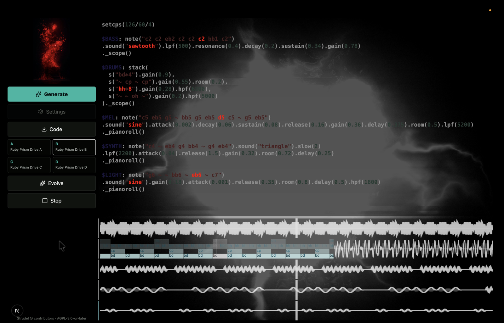

# Strudel AI Visual Coder

Image-to-Strudel live coding workspace for AI-assisted visual music performance.

[Live app](https://strudel.n2f.site)



Strudel AI Visual Coder turns an uploaded image into executable Strudel code, track-level visual widgets, and an audio-reactive shader scene. It is designed for desktop live-coding workflows, short-form visual music capture, and performance-style iteration.

> Desktop browser required. The app uses CodeMirror, WebGL, and browser audio APIs, so mobile visitors are shown a desktop-only notice.

---

## 한국어

### 개요

Strudel AI Visual Coder는 이미지를 분석해 Strudel 음악 코드와 오디오 반응형 비주얼을 생성하는 웹앱입니다. 이미지를 업로드하면 AI가 색감, 질감, 공간감, 대비, 장면 분위기를 해석하고, 브라우저에서 바로 재생 가능한 Strudel 패치를 만듭니다.

생성된 패치는 코드 에디터에서 직접 수정할 수 있고, 트랙별 피아노롤/웨이브폼과 WebGL 셰이더가 함께 반응합니다. 화면 캡처나 영상 합성에 사용할 수 있도록 코드, 위젯, 셰이더가 한 화면에 배치됩니다.

### 주요 기능

- **이미지 기반 음악 생성**: 업로드한 이미지에서 제목, BPM, 스케일, 악기 구성, Strudel 코드를 생성합니다.
- **트랙 라벨 구조**: `$DRUMS`, `$BASS`, `$MEL`, `$SYNTH`, `$LIGHT`, `$TEXTURE` 같은 트랙 단위 코드를 생성합니다.
- **인앱 Strudel 실행**: `@strudel/web`을 사용해 별도 REPL 임베드 없이 앱 안에서 바로 재생합니다.
- **라이브 코드 편집**: CodeMirror에서 생성된 Strudel 코드를 바로 수정하고, 재생 중에도 변경 내용을 재평가합니다.
- **트랙별 비주얼 위젯**: 피아노롤과 waveform scope를 트랙별로 표시하고, 신호가 없는 위젯은 숨깁니다.
- **오디오 반응형 셰이더**: 드럼, 베이스, 멜로디, 신스, 텍스처 신호가 각각 다른 WebGL 효과에 연결됩니다.
- **Variant + Evolve**: A/B/C/D 변주를 생성하고, 현재 변주들을 바탕으로 이어지는 새 변주를 만듭니다.
- **DJ식 큐 전환**: 재생 중 변주를 선택하면 다음 마디 기준으로 큐하고, AI bridge를 통해 긴 크로스페이드를 시도합니다.
- **AI Visual Style Generator**: 이미지 분석 결과로 `foggy`, `glitch`, `liquid`, `metallic`, `bloom`, `scanline` 값을 생성합니다.
- **Semantic Vocal Chop**: 이미지에서 추출한 단어와 형태소를 AI 음성으로 합성하고, `$VOICE` 트랙에서 보컬 찹처럼 잘라 사용합니다.
- **GPT / Kanana 선택**: 기본은 OpenAI GPT이며, Settings에서 Kanana-compatible endpoint를 선택할 수 있습니다. Kanana 선택 시 보이스 텍스처도 Kanana 오디오 응답을 우선 사용합니다.
- **HEIC/HEIF 지원**: iPhone 이미지는 브라우저에서 JPEG로 변환한 뒤 분석합니다.

### 사용 방법

1. 데스크톱 브라우저에서 [strudel.n2f.site](https://strudel.n2f.site)를 엽니다.
2. 좌측 이미지 영역을 눌러 이미지를 업로드합니다.
3. `Generate`를 눌러 A/B/C/D 변주를 생성합니다.
4. 생성이 끝나면 첫 번째 패치가 로드되고 자동 재생됩니다.
5. 코드 에디터에서 Strudel 코드를 직접 수정합니다.
6. 재생 중 A/B/C/D를 눌러 변주를 큐합니다.
7. `Code` 버튼으로 현재 Strudel 코드를 `.js` 파일로 저장합니다.

### 로컬 실행

```bash
npm install
npm run dev
```

개발 서버:

```text
http://localhost:3000
```

### 환경변수

`.env.example`을 복사해 `.env.local`을 만듭니다.

```bash
cp .env.example .env.local
```

```env
OPENAI_API_KEY=
OPENAI_MODEL=gpt-5.5
OPENAI_TTS_MODEL=gpt-4o-mini-tts
OPENAI_TTS_VOICE=ash
KANANA_API_KEY=
```

- `OPENAI_API_KEY`: GPT 기반 이미지 분석과 Strudel 생성에 필요합니다.
- `OPENAI_MODEL`: 사용할 OpenAI 모델명입니다. 기본값은 `gpt-5.5`입니다.
- `OPENAI_TTS_MODEL`: Semantic Vocal Chop 생성에 사용할 TTS 모델입니다. 기본값은 `gpt-4o-mini-tts`입니다.
- `OPENAI_TTS_VOICE`: Semantic Vocal Chop 생성에 사용할 음성입니다. 기본값은 `ash`입니다.
- `KANANA_API_KEY`: Kanana provider를 사용할 때의 서버 기본 키입니다. 사용자가 Settings에서 직접 입력할 수도 있습니다.

실제 API Key는 `.env.local`에만 보관하세요. `.env*` 파일은 Git에서 무시됩니다.

### 명령어

| Command | Description |
| --- | --- |
| `npm run dev` | 로컬 개발 서버 실행 |
| `npm run typecheck` | TypeScript 타입 검사 |
| `npm run build` | 프로덕션 빌드 |
| `npm run start` | 빌드된 앱 실행 |

### 프로젝트 구조

```text
app/
  api/generate-strudel/route.ts  # 이미지 분석 및 Strudel 코드 생성 API
  globals.css                    # UI, CodeMirror, shader/layout 스타일
  page.tsx                       # 메인 앱, Strudel 런타임, 위젯, shader, variant 전환

lib/
  code-highlight.ts              # CodeMirror active range decoration
  strudel-ai-prompt.ts           # AI 시스템 프롬프트 및 코드 정규화
  strudel-presets.ts             # fallback composition preset
  strudel-runtime.ts             # Strudel widget canvas/runtime helper

types/
  *.d.ts                         # 타입 보강
```

### 기술 스택

| Area | Stack |
| --- | --- |
| Framework | Next.js App Router |
| UI | React |
| Code Editor | CodeMirror |
| Music Engine | `@strudel/web` |
| Visual Widgets | `@strudel/draw`, custom canvas routing |
| Shader | WebGL canvas |
| AI | OpenAI Responses API, optional Kanana-compatible endpoint |
| Deployment | Vercel |

### 배포

Vercel 프로젝트에 다음 환경변수를 설정합니다.

```text
OPENAI_API_KEY
OPENAI_MODEL
KANANA_API_KEY
```

빌드 명령:

```bash
npm run build
```

### 구현 메모

- 업로드 이미지는 API 요청 크기 제한을 피하기 위해 클라이언트에서 압축됩니다.
- 모바일 브라우저에서는 오디오 정책, WebGL 성능, 코드 편집 UX가 불안정할 수 있어 데스크톱 전용 안내 화면을 표시합니다.
- AI가 생성한 Strudel 코드에 브라우저 런타임과 맞지 않는 표현이 들어올 수 있어 `normalizeStrudelCode`에서 일부 표현을 보정합니다.
- 서버는 생성된 Strudel 코드를 브라우저에 보내기 전에 문법 검사를 수행하며, Kanana 결과가 유효하지 않으면 GPT fallback 경로를 사용합니다.
- 브라우저 자동재생 정책 때문에 `Generate` 또는 `Play` 시점에 오디오 컨텍스트를 먼저 깨웁니다.
- `$VOICE` 트랙에 쓰이는 음성은 AI로 생성된 보이스 텍스처이며, 사람의 실제 녹음이 아닙니다.

### 라이선스 및 Attribution

이 프로젝트는 `AGPL-3.0-or-later`로 배포됩니다.

Strudel AI Visual Coder는 Strudel 생태계 위에 구축되어 있습니다. 특히 `@strudel/web`, `@strudel/draw`, `@strudel/core`, `@strudel/webaudio` 패키지를 사용하며, 해당 패키지들은 `AGPL-3.0-or-later` 라이선스를 따릅니다.

- Strudel: https://strudel.cc/
- Strudel source: https://github.com/tidalcycles/strudel
- 자세한 attribution: [NOTICE.md](./NOTICE.md)

---

## English

### Overview

Strudel AI Visual Coder is a desktop-first web app that transforms an uploaded image into playable Strudel code, track-level visual widgets, and an audio-reactive WebGL shader. It analyzes visual mood, color, texture, space, and contrast, then generates a live-codable music patch directly in the browser.

The interface is built for visual music capture: generated code, piano rolls, waveform scopes, and shader feedback can be recorded or composited as a screen overlay.

### Features

- **Image-to-Strudel generation**: Creates title, BPM, scale, instruments, shader style, and executable Strudel code from an uploaded image.
- **Labeled track patches**: Generates track blocks such as `$DRUMS`, `$BASS`, `$MEL`, `$SYNTH`, `$LIGHT`, and `$TEXTURE`.
- **In-app playback**: Uses `@strudel/web` directly instead of embedding the official REPL UI.
- **Live CodeMirror editor**: Edit generated code immediately; changes are re-evaluated during playback.
- **Track widgets**: Displays piano roll and waveform scope widgets per track, hiding empty widgets after signal detection.
- **Audio-reactive shader**: Maps drums, bass, melody, synth, light, and texture signals to separate WebGL behaviors.
- **Variant Generation + Evolve**: Generates A/B/C/D variants and evolves them into new compatible variations.
- **Quantized DJ-style switching**: Queues variant changes on musical boundaries and uses AI bridge patches for longer transitions.
- **AI Visual Style Generator**: Produces shader parameters such as `foggy`, `glitch`, `liquid`, `metallic`, `bloom`, and `scanline`.
- **Semantic Vocal Chop**: Turns image-derived words and morphemes into an AI-generated voice texture for the `$VOICE` track.
- **GPT / Kanana provider selection**: Defaults to OpenAI GPT and optionally supports a Kanana-compatible endpoint. When Kanana is selected, voice texture synthesis uses Kanana audio first.
- **HEIC/HEIF support**: Converts iPhone images to JPEG in the browser before analysis.

### Quick Start

```bash
npm install
npm run dev
```

Open:

```text
http://localhost:3000
```

### Environment Variables

Create `.env.local` from `.env.example`.

```bash
cp .env.example .env.local
```

```env
OPENAI_API_KEY=
OPENAI_MODEL=gpt-5.5
OPENAI_TTS_MODEL=gpt-4o-mini-tts
OPENAI_TTS_VOICE=ash
KANANA_API_KEY=
```

Never commit real API keys. `.env*` files are ignored by Git.

### Commands

| Command | Description |
| --- | --- |
| `npm run dev` | Start the local dev server |
| `npm run typecheck` | Run TypeScript checks |
| `npm run build` | Create a production build |
| `npm run start` | Start the built app |

### Deployment

Set these variables in your Vercel project:

```text
OPENAI_API_KEY
OPENAI_MODEL
KANANA_API_KEY
```

Build command:

```bash
npm run build
```

### Notes

- Desktop browser required. Mobile visitors are shown a desktop-only notice.
- Uploaded images are compressed client-side to avoid request size limits.
- AI-generated Strudel may include unstable expressions, so `normalizeStrudelCode` applies compatibility fixes before playback.
- Generated Strudel is syntax-checked on the server before reaching the browser; invalid Kanana output can fall back to GPT generation.
- Browser autoplay rules can affect audio startup; the app tries to unlock the audio context during `Generate` or `Play`.
- The `$VOICE` track uses an AI-generated voice texture, not a human recording.

### License and Attribution

This project is distributed under `AGPL-3.0-or-later`.

Strudel AI Visual Coder is built on top of the Strudel ecosystem. It uses `@strudel/web`, `@strudel/draw`, `@strudel/core`, and `@strudel/webaudio`, which are licensed under `AGPL-3.0-or-later`.

- Strudel: https://strudel.cc/
- Strudel source: https://github.com/tidalcycles/strudel
- Detailed notices: [NOTICE.md](./NOTICE.md)
